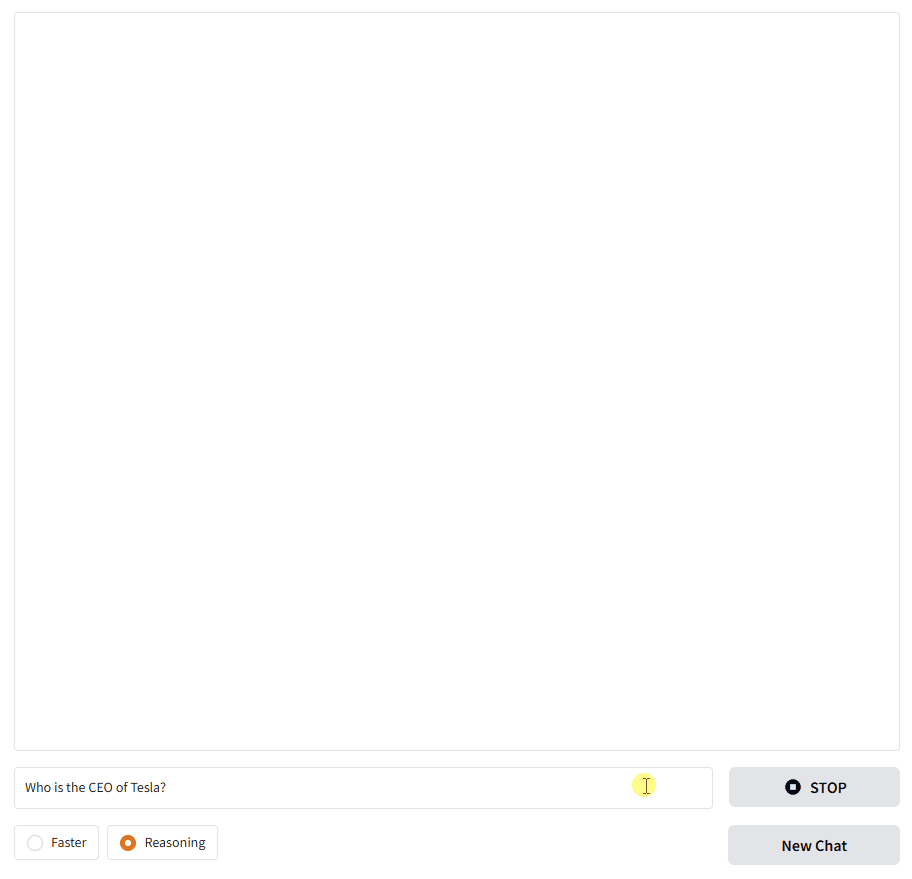

# Chat with Tool

A comprehensive AI chat interface built with Gradio that brings together conversational AI capabilities with practical tool integration. This application demonstrates how modern language models can seamlessly interact with external tools while providing users with transparent insight into the AI's reasoning process, creating a more trustworthy and educational experience for anyone exploring AI-powered conversations.


## Key Features

- **Interactive chat interface**: Intuitive web UI using Gradio
- **Tool call support**: External tool integration via MCP (Model Context Protocol)
- **Reasoning mode**: Choose between fast response and detailed reasoning
- **Real-time streaming**: Display responses streamed in real-time
- **Message management**: Intelligent message slicing to fit token limits


## Installation and Running

### Install required packages

```
pip install -r requirements.txt
```

### Running

```
# Default run (localhost:8001)
python main.py

# Run with custom settings
python main.py --server_name 0.0.0.0 --server_port 8080 --share
```


## Usage

### Basic Chat
- Enter your question in the text input box and press Enter or click the send button
- AI streams the response in real-time

### Mode Selection
- **Faster**: Fast response mode (skips reasoning process)
- **Reasoning**: Response mode including detailed reasoning process

### Tool Usage
- AI automatically calls external tools as needed
- You can check the tool execution process and results in real-time

### Chat Management
- **STOP**: Stop the current response generation
- **New Chat**: Reset chat history

